# `bullet` : Beautiful Python Prompts Made Simple
<p align=center>
<br><br><br>
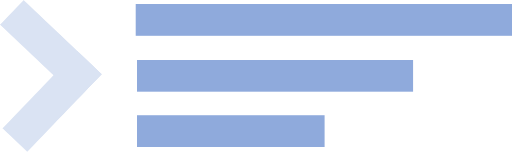
<br><br><br>
<a target="_blank"></a>
<a target="_blank" href="https://www.python.org/downloads/" title="Python version"></a>
<a target="_blank" href="https://opensource.org/licenses/MIT" title="License: MIT"></a>
<a target="_blank" href="http://makeapullrequest.com" title="PRs Welcome"></a>
</p>

***
> 🎨 Customize prompts in your Python CLI tool. Extensive support for formatting, colors, background colors, styling, and etc. Also supports emojis!
***

<p align="center">
    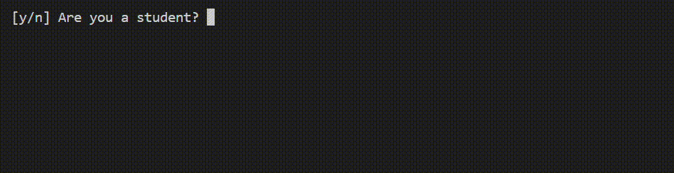
</p>

> See the sample code for the above demo in `./examples/prompt.py`.

## ✨News: `bullet==2.2.0` is up (Finally!)

You can now download the newest version of bullet on PyPI!

## Bullet-lists and checkboxes
> 🎨 Robust support for user-defined styles.
<table>
    <tr>
        <th>./examples/classic.py</th>
        <th>./examples/colorful.py</th>
        <th>./examples/star.py</th>
    </tr>
    <tr>
        <td>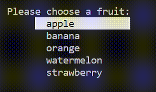</td>
        <td>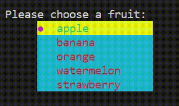</td>
        <td>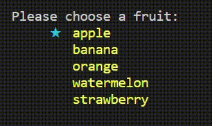</td>
    </tr>
    <tr>
        <th>Vanilla checkbox</th>
        <th>Checkbox + styles.Exam</th>
        <th>Bullet + styles.Greece</th>
    </tr>
    <tr>
        <td>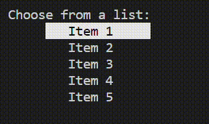</td>
        <td>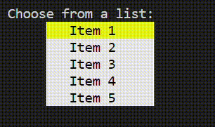</td>
        <td>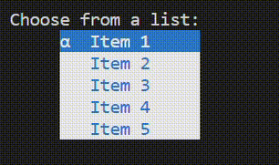</td>
    </tr>
    <tr>
        <th>Bullet + styles.Ocean</th>
        <th>Bullet + styles.Lime</th>
        <th>Bullet + styles.Christmas</th>
    </tr>
    <tr>
        <td>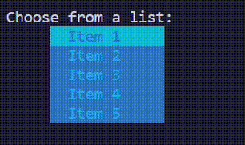</td>
        <td>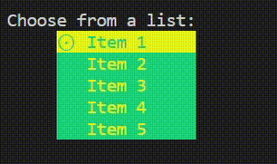</td>
        <td>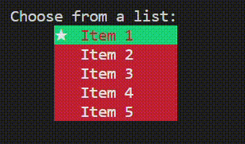</td>
    </tr>
</table>

## ScrollBar

<p align="center">
    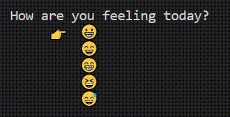
</p>

> See the sample code for the above demo in `./examples/scrollbar.py`.

## Other input prompts
> ⛔ Passwords
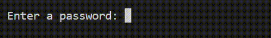

> 👍 Yes/No Questions
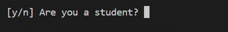

> 🔢 Numbers


## Setting up `bullet`
> From PyPI
```shell
$ pip install bullet
```
> Build from Source
```shell
$ git clone https://github.com/bchao1/bullet.git
$ cd bullet
$ pip install .
```
## Documentation
📖 See <a href="./DOCUMENTATION.md"> Documentation</a>.

> Currently supported prompts: `Bullet`, `Check`, `Input`, `Numbers`, `Password`, `YesNo`, `VerticalPrompt`, `SlidePrompt`, `Scrollbar`.

## Contributing
🎉 Directly send PRs! Make sure development is done and tested in `Python >= 3.6`.

## Todo
- Windows Support
- Search bar with autocomplete
