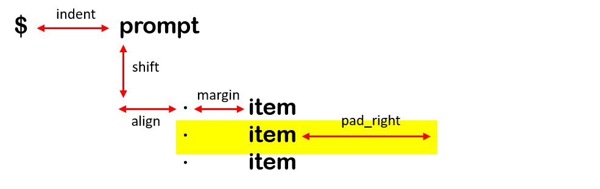

# `bullet` : Beautiful Python List Prompts Made Easy
<p align=center>

<br>
<a target="_blank"></a>
<a target="_blank" href="https://www.python.org/downloads/" title="Python version"></a>
<a target="_blank" href="https://opensource.org/licenses/MIT" title="License: MIT"></a>
<a target="_blank" href="http://makeapullrequest.com" title="PRs Welcome"></a>
</p>

***
> 🎨 Customize bullet list prompts in your Python CLI tool. Extensive support for formatting, colors, background colors, and etc.
***

```python
from bullet import Bullet

cli = Bullet(...)
result = cli.launch(prompt)
```

<p align=center>


</p>

## Setup
```shell
$ pip install bullet
```

## Documentation

> 👷 To fully customize your list prompt, you'll have to take total control of formatting and colors. Here's what you need to know.

### Using `bullets`
```python
from bullet import Bullet
cli = Bullet()  # Create a Bullet object
result = cli.launch()  # Launch a list prompt
```

### Defining Choices
```python
cli = Bullet(choices = ["first item", "second item", "thrid item"])
```

### Customize Bullets
```python
cli = Bullet(bullet = "★")
```

### Customize Colors
```python
from bullets import colors
```
> 🎨 The following colors are supported in `bullets`. 
```
black, red, green, yellow, blue, magenta, cyan, white
```
> 🎨 Remember to specify `foreground` and `background`.
```python
black_foreground = colors.foreground["black"]
white_background = colors.background["white"]
```
> 🎨 Define the following colors when initializing the `Bullet` object.
- Use foreground colors:
    - `bullet_color`
    - `word_color`
    - `word_on_switch`
- Use background colors:
    - `background_color`
    - `background_on_switch`

### Formatting
> 📐 Define the following when initializaing the `Bullet` object.
- `indent`: distance from left-boundary to start of prompt.
- `pad_right`: extended background length.
- `align`: distance between bullet and start of prompt.
- `margin`: distance between list item and bullets.
- `shift`: number of new lines between prompt and first item.

<p align=center>

</p>