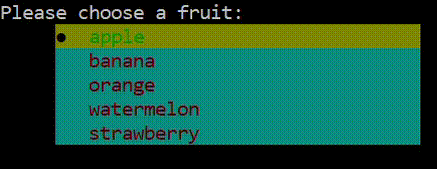

# `bullets` : A Robust Python List Prompt Package
<p align=center>

<br>
<a target="_blank"></a>
<a target="_blank" href="https://www.python.org/downloads/" title="Python version"></a>
<a target="_blank" href="https://opensource.org/licenses/MIT" title="License: MIT"></a>
<a target="_blank" href="http://makeapullrequest.com" title="PRs Welcome"></a>
</p>

***
> 🎨 Customize bullet list prompts in your CLI tool without effecting previous or future outputs.
***

<p align=center></p>

## Usage

```python
from bullets import BulletCli

cli = BulletCli()
result = cli.launch(prompt = "Choose from a list: ")
print(result)
```

## Examples